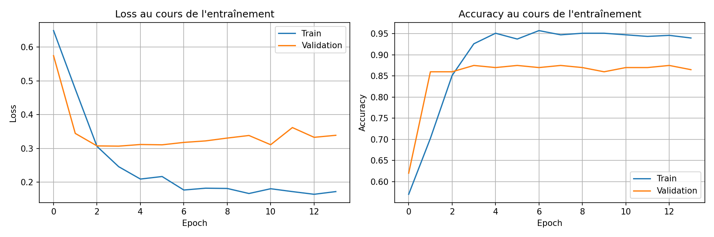

# Modèle DungeonOracle

## 1. Baseline (Linear)
**Commande :** `uv run train_dungeon_logs.py`

**Résultats :**
- Accuracy : 79.70%
- Paramètres : 9,397,909

**Analyse :**
- **Avantages :** Configuration par défaut.
- **Inconvénients :**
  - Nombre de paramètres excessif (9M+).
  - Performance médiocre car l'architecture linéaire ignore l'ordre des événements.

## 2. RNN Simple
**Commande :** `uv run train_dungeon_logs.py --mode rnn`

**Résultats :**
- Accuracy : 82.57%
- Paramètres : 145,513

**Analyse :**
- **Avantages :**
  - Réduction massive des paramètres (de 9M à 145k).
  - Gain de performance (+2.87%) grâce à la prise en compte de la séquentialité.
- **Inconvénients :**
  - Performance limitée par le problème de vanishing gradient sur les longues séquences.

## 3. LSTM (Long Short-Term Memory)
**Commande :** `uv run train_dungeon_logs.py --mode lstm`

**Résultats :**
- Accuracy : 96.07%
- Paramètres : 546,445

**Analyse :**
- **Avantages :**
  - Excellente performance (+13.5% vs RNN).
  - Gestion efficace des dépendances à long terme.
- **Inconvénients :**
  - Nombre de paramètres plus élevé que le RNN (x3.7), mais reste bien inférieur à la baseline.

## 4. GRU Optimisé (Gated Recurrent Unit)
**Commande :**
```bash
uv run train_dungeon_logs.py --mode gru --embed_dim 8 --hidden_dim 16 --dropout 0.6 --weight_decay 0.01 --optimizer adam --learning_rate 0.001 --early_stopping --patience 7 --epochs 50
```

**Résultats :**
- Accuracy : 84.27%
- Paramètres : 1,625

**Analyse :**
- **Avantages :**
  - Modèle ultra-léger (seulement 1,625 paramètres).
  - Performance remarquable pour cette taille (supérieure au RNN de 145k params).
  - Forte régularisation pour une robustesse maximale.
- **Inconvénients :**
  - Accuracy en retrait par rapport au LSTM standard (84% vs 96%).


