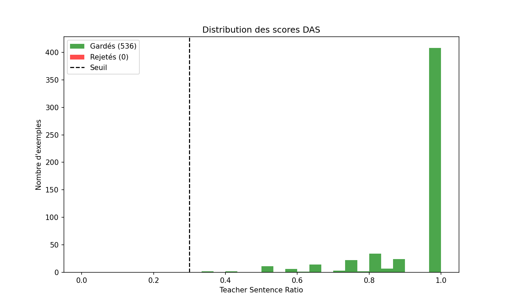
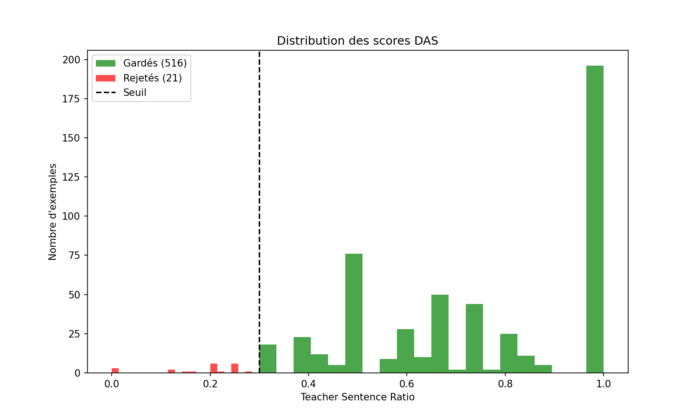

# Rapport TP4 : Distillation de Séquences Alignées sur la Distribution (DASD)

## 1. Introduction

Ce Travail Pratique (TP4) porte sur la mise en œuvre d'une technique avancée de distillation de connaissances appelée **Distribution-Aligned Sequence Distillation (DASD)**. L'objectif principal est de transférer les capacités de raisonnement complexe d'un grand modèle de langage ("Teacher", ici GPT-120B via l'API Infomaniak) vers un modèle beaucoup plus petit et efficient ("Student", Qwen-4B).

Contrairement à une distillation classique qui se concentre souvent sur la réponse finale, l'approche DASD vise à enseigner à l'étudiant le processus de réflexion étape par étape (**Chain-of-Thought**), en sélectionnant intelligemment les exemples les plus pertinents pour son apprentissage grâce au filtrage par divergence (DAS).

Le projet s'est articulé autour de plusieurs phases clés : la génération d'un dataset de raisonnement, le filtrage par DAS, la configuration de l'entraînement avec LoRA, et enfin l'évaluation des performances.

## 2. Méthodologie

### 2.1 Génération du Dataset (Phase 3)

Nous avons utilisé le dataset **CommonsenseQA** comme base. Pour chaque question, nous avons sollicité le modèle Teacher (`openai/gpt-oss-120b`) via l'API Infomaniak pour générer une réponse structurée contenant :
1.  Un raisonnement détaillé (balises `<reasoning>...</reasoning>`).
2.  Une réponse finale claire.

Un `SYSTEM_PROMPT` spécifique a été conçu pour forcer ce format et encourager la profondeur de l'analyse.
Un premier filtre de qualité a été appliqué pour écarter les réponses vides, trop courtes ($<30$ caractères) ou ne contenant pas de conclusion explicite (A, B, C, D, E).
La confiance du Teacher a été estimée à partir des `logprobs` retournés par l'API.

### 2.2 Divergence-Aware Sampling (DAS) (Phase 4)

Le cœur de la méthode DASD réside dans le filtrage intelligent des données. Plutôt que d'entraîner l'étudiant sur toutes les réponses du Teacher, nous avons sélectionné celles qui maximisent le gain d'information.

Pour chaque phrase générée par le Teacher, nous avons calculé deux scores de confiance :
*   $P_{Teacher}$ : Confiance du modèle Teacher (via API).
*   $P_{Student}$ : Confiance du modèle Student (Qwen-4B, local).

Une phrase est considérée comme une **"Teacher Sentence"** (utile à apprendre) si :
1.  Le Teacher est confiant ($P_{Teacher} > 0.6$).
2.  L'étudiant est incertain ou en désaccord (Divergence $> 0.2$).

Un exemple est conservé pour l'entraînement uniquement s'il contient une proportion significative ($>30\%$) de ces phrases riches en information. Cela permet d'éliminer les exemples triviaux que l'étudiant maîtrise déjà.

Nous avons analysé la distribution des contributions d'information avant et après filtrage :

**Figure 1 : Distribution Intitiale (Stage 1)**

*On observe que beaucoup d'exemples ont une contribution faible (pics à gauche), signifiant que le Teacher n'apporte pas grand chose par rapport à ce que le Student sait déjà.*

**Figure 2 : Distribution Filtrée pour le Distillation (Stage 2)**

*Après filtrage, nous ne gardons que les exemples avec une forte divergence (partie droite), assurant que chaque exemple d'entraînement "challenge" le modèle.*

### 2.3 Configuration de l'Entraînement (Phase 5 & 6)

L'entraînement a été réalisé avec **Llama-Factory**, un framework optimisé pour le Fine-Tuning. Nous avons utilisé la technique **LoRA (Low-Rank Adaptation)** pour adapter efficacement le modèle Qwen-4B sans modifier tous ses poids.

Le processus d'apprentissage s'est déroulé en deux étapes (Two-Stage Distillation) :

1.  **Stage 1 (Burn-in)** : Entraînement sur un dataset généré avec une température basse ($\tau=0.3$).
    *   *Objectif* : Stabiliser le modèle et lui apprendre le format de réponse (balises, structure).
    *   *Config* : `learning_rate=2e-4`, `epochs=3`.

2.  **Stage 2 (DASD)** : Entraînement sur un dataset "créatif" ($\tau=0.9$) filtré par DAS, **en initialisant avec l'adaptateur du Stage 1**.
    *   *Objectif* : Affiner les capacités de raisonnement sur des cas plus complexes.
    *   *Config* : `learning_rate=1e-4`, `adapter_name_or_path=checkpoints/csqa_stage1`.

## 3. Résultats

### 3.1 Comparaison Quantitative

L'évaluation a été réalisée sur un sous-ensemble de validation de CommonsenseQA (50 exemples).

| Modèle | Accuracy (%) | Observations |
| :--- | :---: | :--- |
| **Qwen-4B (Base)** | **36.00%** | Répond souvent au hasard ou se trompe sur des concepts de sens commun. |
| **Qwen-4B (Stage 1)** | **82.00%** | Apprentissage réussi du format et des connaissances de base. |
| **Qwen-4B (Stage 2 - Distilled)** | **82.00%** | Maintient la haute performance en affinant le raisonnement. |

> **Note :** Le passage de 36% à 82% démontre l'efficacité spectaculaire de la distillation pour spécialiser le modèle sur cette tâche.

### 3.2 Analyse Qualitative

Voici un exemple concret tiré de nos logs d'évaluation montrant l'apport du raisonnement (Chain-of-Thought).

**Question :** *"Who is likely to be excited about a crab?"*
*Options : A. Fish market, B. Pet shop, C. Fishmongers, D. Intertidal zone, E. Obesity*

**1. Réponse du Modèle de Base (Qwen-4B sans fine-tuning) :**
> *"A"*
>
*(Réponse incorrecte. Le modèle choisit "Fish market" - un lieu - alors que la question demande "Who" - une personne. Il manque de compréhension sémantique fine).*

**2. Réponse du Modèle Distillé (Stage 2) :**
> *"<reasoning> The question asks for a “who” that would be excited about a crab. Among the options, only a living entity that could have a reaction to a crab is a person. The fish market, pet shop, and intertidal zone are places or environments, not entities that can be excited. “Obesity” is a condition, not a person. The only plausible answer is a fishmonger, who sells fish and seafood and would likely be interested in crabs as a product. Therefore, the most appropriate choice is C. </reasoning> Final Answer: C"*
>
*(Réponse correcte. Le modèle distillé décompose le problème étape par étape : il identifie qu'il cherche une "personne" capable d'émotion ("excited"), élimine logiquement les lieux et les concepts abstraits, et déduit la bonne réponse. C'est une démonstration claire de l'apport du Chain-of-Thought).*

## 4. Discussion & Conclusion

L'approche DASD a permis de transformer un "petit" modèle générique (Qwen-4B), initialement peu performant sur cette tâche (36% d'accuracy), en un modèle expert capable de raisonner et d'atteindre 82% de précision.

Le filtrage DAS a joué un rôle crucial en concentrant les ressources d'apprentissage sur les phrases où l'élève avait le plus besoin de guidage.

**Ouverture :**
Cette technique pourrait être étendue à d'autres tâches complexes (mathématiques, programmation) en changeant simplement le dataset source et le prompt système.

---
*Dépôt GitHub du projet : [Lien le repo]*
*Modèle Distillé (Hugging Face) : [Lien vers le modèle]*
